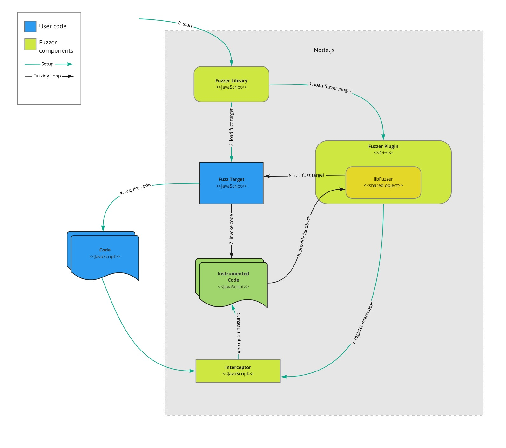

# Architecture

## Constraints

Main focus lies on fuzzing [Node.js](https://nodejs.org) libraries and backend
applications using [libFuzzer](https://llvm.org/docs/LibFuzzer.html).

Support for:

- Linux x86_64
- macOS x86_64 and arm64
- Windows x86_64

Out of scope:

- Other runtimes or browser support

## Components and Interactions

From an architectural view the fuzzer consists of multiple components and also
needs user provided parts. These components and their interactions will be
discussed in this section.

The _fuzzing library_ is the main entry point and is used to start fuzzing. It
is invoked with the name of a _fuzz target_ module and possible fuzzer options.
As a first step it loads a
[native plugin](https://nodejs.org/api/addons.html#wrapping-c-objects) Node.js
addon, _fuzzer plugin_, to interact with libFuzzer and registers a `require`
hook, _interceptor_, to instrument subsequently loaded code.

The _interceptor_ transforms code using [Babel](https://babeljs.io/) to provide
feedback to the fuzzer in multiple ways. It extends the loaded code to gather
coverage statistics so that the fuzzer can detect when new code paths are
reached. And it also intercepts comparison functions, like `==` or `!=`, to
detect the parts of the provided input that should be mutated and in what way.
Available feedback methods are defined in libFuzzer's
[hook interface definitions](https://github.com/llvm/llvm-project/blob/main/compiler-rt/include/sanitizer/common_interface_defs.h).

After the initial setup _fuzzer library_ loads the _fuzz target_, a module
exporting a `fuzz` function, which in turn has to call the actual code under
test using the provided fuzzing data. Note that the loaded code in instrumented
by _instrumentor_ and will provide fuzzer feedback.

During the actual fuzzing run the fuzzer repeatedly invokes the `fuzz` function
and mutates the provided data based on feedback from the instrumented code.

Once a crash is found it logs it on the console and stops.

## Decisions

### Fuzzer integration

**Context**: To interact with the fuzzer there needs to be a way to initialize
libFuzzer, receive _fuzzing data_ in the _fuzz target_ and invoke the fuzzer's
callback functions. Possible solutions could be a direct integration into the V8
runtime or using a Node.js based approach.

**Decision**: A Node.js based approach seems to be sufficient for our purpose.
Native plugins provide a stable ABI to interact with V8, JavaScript code and
vice versa. We will use that as base for the fuzzer.

**Consequences**: No other runtime can be supported, this includes browsers.

### Instrumentation

**Context**: libFuzzer is a coverage-based fuzzer and hence needs coverage
information to detect progress and comparison hints to improve mutations. These
feedback mechanisms have to be added to the application code without user
intervention.

**Decision**: Use the `istanbul-lib-hook` library to hook into dynamic code
loading and `babel` plugins to extend the loaded code with the required feedback
functionality. Instrumenting the code at such a high level leads to an
independence of the underlying JavaScript engine. Furthermore, it is easily
possible to decide if a loaded module should be instrumented or not.

**Consequences**: Independence of JavaScript engine, fine-grained
instrumentation control
