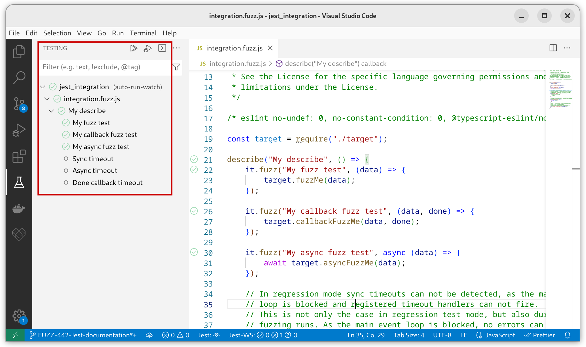
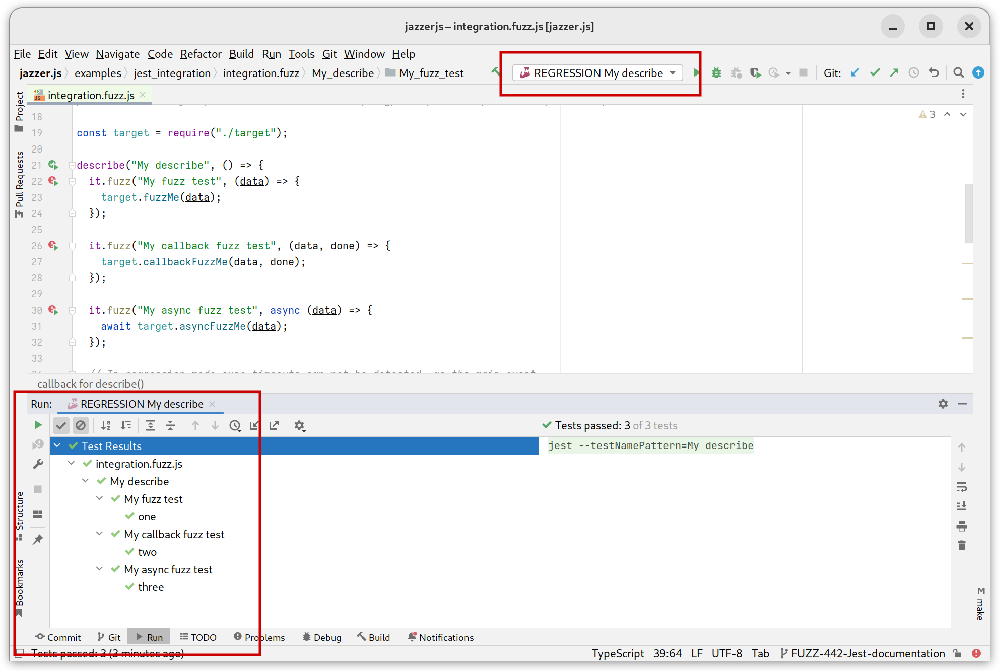

# Fuzzing using the Jest integration

To use fuzzing in your normal development workflow, a tight integration into the
[Jest test framework](https://jestjs.io/) is provided. Using this, fuzz tests
can be executed alongside your normal unit tests and seamlessly detect problems
on your local machine or in your CI, and check that found bugs stay resolved
forever.

Furthermore, the Jest integration enables great IDE support, so that individual
inputs can be run, or even debugged, similar to what you would expect from
normal Jest tests.

The Jest integration provides two modes of execution, which will be explained in
detail further down on this page.

- **Fuzzing Mode**: Fuzzing a function through a Jest test.
- **Regression Mode**: Using initially provided seeds and inputs of found
  problems to execute the Jest test with.

## Setting up the Jazzer.js Jest integration

Jest enables the execution of tests by third-party tools through custom test
runners. Jazzer.js provides such a runner in the `@jazzer.js/jest-runner`
package.

To use the integration, add a `dev-dependency` to `@jazzer.js/jest-runner` to
your project. To do so, execute the following command in your project root
directory.

```shell
npm install --save-dev @jazzer.js/jest-runner
```

This will install the custom Jest runner along with all other required Jazzer.js
dependencies.

For Jest to pick up the custom fuzz test runner, it has to be added to the Jest
configuration in the `package.json` or `jest.config.js`, as described on the
[Configuring Jest](https://jestjs.io/docs/configuration) documentation page. The
following snippet shows how to add the Jazzer.js fuzz test runner to the Jest
configuration in `package.json`, so that all files with the suffix `.fuzz.js`
will be executed by it. Other tests are still executed by the default test
runner.

```json
{
	"name": "jest-integration-example",
	"scripts": {
		"test": "jest",
		"fuzz": "JAZZER_FUZZ=1 jest",
		"coverage": "jest --coverage"
	},
	"devDependencies": {
		"@jazzer.js/jest-runner": "1.1.0",
		"jest": "29.3.1"
	},
	"jest": {
		"projects": [
			{
				"displayName": "test"
			},
			{
				"runner": "@jazzer.js/jest-runner",
				"displayName": {
					"name": "Jazzer.js",
					"color": "cyan"
				},
				"testMatch": ["<rootDir>/**/*.fuzz.js"]
			}
		]
	}
}
```

Further fuzzer configuration can be specified in `.jazzerjsrc.json` in the
project directory using the following format. These are the same properties
which can be specified through the CLI client.

```json
{
	"includes": ["*"],
	"excludes": ["node_modules"],
	"customHooks": [],
	"fuzzerOptions": [],
	"sync": false,
	"timeout": 1000
}
```

## Writing a Jest fuzz test

To create a fuzz test, the `fuzz` function on Jest's `test` and `it` can be
used.

`fuzz` expects similar parameters as normal Jest tests, but provides fuzzer
generated input as a first parameter to the test function. As expected, the
input generation is guided by coverage and other execution feedback, which is
possible due to code instrumentation.

The passed in fuzzer input is of type `Buffer`, a subclass of `Uint8Array`, and
can be used to create needed parameters for the actual code under test, so that
the fuzzer can detect the usage of parts of the input and mutate them in the
next iterations, to reach new code paths.

The resulting code looks very similar to normal Jest tests.

```javascript
describe("My describe", () => {
	it.fuzz(
		"My fuzz test",
		(data) => {
			target.fuzzMe(data);
		},
		2000
	);
});
```

If the function you want to test expects parameters of types other than
`Buffer`, you have to take care of constructing the corresponding arguments from
the provided buffer. To facilitate this step, Jazzer.js provides a utility class
`FuzzedDataProvider` that you can use to consume data of certain types from the
fuzzer input. An example on how to use everything in combination is shown below.

```js
const target = require("./target");
const { FuzzedDataProvider } = require("@jazzer.js/core");

describe("My describe", () => {
  it.fuzz("My fuzz test", (data) => {
    const provider = new FuzzedDataProvider(data);
    target.fuzzMeMore(
      provider.consumeNumber(),
      provider.consumeBoolean(),
      provider.consumeRemainingAsString());
  });
```

For more information on how to use the `FuzzedDataProvider` class, please refer
to the [example](../tests/FuzzedDataProvider/fuzz.js), the
[tests](../packages/core/FuzzedDataProvider.test.ts), and the
[implementation](../packages/core/FuzzedDataProvider.ts) of the
`FuzzedDataProvider` class.

### Async Jest fuzz tests

Similar on how one would
[test asynchronous code in Jest](https://jestjs.io/docs/asynchronous), it's
possible to use `async/await`, `Promise` and `done callback` based tests.

```javascript
describe("My describe", () => {
  it.fuzz("My callback fuzz test", (data, done) => {
    target.callbackFuzzMe(data, done);
  });

  it.fuzz("My async fuzz test", async (data) => {
    await target.asyncFuzzMe(data);
  });
)};
```

### Setup and teardown

The Jazzer.js fuzz test runner supports Jest's setup and teardown functions, as
described on the [Setup and Teardown](https://jestjs.io/docs/setup-teardown)
documentation page.

This includes `beforeAll`, `afterAll`, `beforeEach` and `afterEach`.

## Executing Jest fuzz tests

As mentioned above, the Jazzer.js fuzz test runner provides two modes of
execution: fuzzing mode and regression mode.

### Fuzzing mode

As the name suggests, the fuzzing mode uses Jazzer.js to fuzz a test function.

To execute tests in the fuzzing mode, set the environment variable `JAZZER_FUZZ`
to a non-null value and execute Jest as normal.

```shell
JAZZER_FUZZ=1 npm test
```

**Note**: Due to limitations of the underlying fuzzer, only one fuzz test can be
executed in this mode, all others are skipped by the runner. To start different
fuzz tests the Jest parameter `--testNamePattern` can be used, e.g.
`npx jest --testNamePattern="My describe"`.

Inputs triggering issues, like uncaught exceptions, timeouts, etc., are stored
in a directory structure named according to the test file and internal test
structure. For example, an issue found in the `test` "My fuzz test" in the
`describe` block "My describe" in the test file `fuzztests.fuzz.js` would end up
in the directory `./fuzztest.fuzz/My_describe/My_fuzz_test`. Files in these
directories will be used in the regression mode to verify that the underlying
issues have been resolved.

Furthermore, as fuzzing is a time-consuming task, interesting intermediate
inputs are stored in a similar directory structure located in `.cifuzz-corpus`
at the project root. These inputs are used by the fuzzer to speed up the next
run by reusing the already discovered inputs.

Executing fuzz tests in fuzzing mode on the command line could look like the
following snippet. This output may differ depending on the used Jest reporter.

```shell
» JAZZER_FUZZ=1 npm test

 RUNS   Jazzer.js  ./integration.fuzz.js
INFO: Running with entropic power schedule (0xFF, 100).
INFO: Seed: 3712434369
INFO: Loaded 1 modules   (512 inline 8-bit counters): 512 [0x7fb804068010, 0x7fb804068210),
INFO: Loaded 1 PC tables (512 PCs): 512 [0x7fb7fc7fa010,0x7fb7fc7fc010),
INFO:        0 files found in /jazzer.js/examples/jest_integration/.cifuzz-corpus/integration.fuzz/My_describe/My_fuzz_test/
INFO:        1 files found in /jazzer.js/examples/jest_integration/integration.fuzz/My_describe/My_fuzz_test/
INFO: -max_len is not provided; libFuzzer will not generate inputs larger than 4096 bytes
INFO: seed corpus: files: 1 min: 4b max: 4b total: 4b rss: 173Mb
#2      INITED cov: 3 ft: 3 corp: 1/4b exec/s: 0 rss: 173Mb
#7      REDUCE cov: 3 ft: 3 corp: 1/2b lim: 4 exec/s: 0 rss: 173Mb L: 2/2 MS: 5 CopyPart-ChangeByte-ShuffleBytes-CopyPart-EraseBytes-
#8      REDUCE cov: 3 ft: 3 corp: 1/1b lim: 4 exec/s: 0 rss: 173Mb L: 1/1 MS: 1 EraseBytes-
#1377   REDUCE cov: 6 ft: 6 corp: 2/17b lim: 17 exec/s: 0 rss: 173Mb L: 16/16 MS: 4 CopyPart-CMP-CopyPart-InsertRepeatedBytes- DE: "\377\377\377\37
 FAIL   Jazzer.js  ./integration.fuzz.js (19.887 s)
  ● My describe › My fuzz test

        Error: Welcome to Awesome Fuzzing!

      25 |              s[15] === "!"
      26 |      ) {
    > 27 |              throw Error("Welcome to Awesome Fuzzing!");
         |                      ^
      28 |      }
      29 | };
      30 |

      at Object.fuzzMe (target.js:27:11)
      at integration.fuzz.js:24:12

  ● My describe › My callback fuzz test

        [FuzzerStartError: Fuzzer already started. Please provide single fuzz test using --testNamePattern. Skipping test "My callback fuzz test"]

  ● My describe › My async fuzz test

        [FuzzerStartError: Fuzzer already started. Please provide single fuzz test using --testNamePattern. Skipping test "My async fuzz test"]

Test Suites: 1 failed, 0 passed, 1 total
Tests:       1 failed, 2 skipped, 0 passed, 3 total
Snapshots:   0 total
Time:        21.137 s
Ran all test suites
```

### Regression mode

The regression mode is the default execution mode and verifies that once found
issues are resolved and stay that way.

In this mode, the previously found problematic inputs are used to invoke the
fuzz tests and verify that no error is generated anymore. If the described
directory structure does not contain inputs for a given test, it will be skipped
by the runner.

The file name of every input is used to generate a dedicated test entry in the
overall Jest report.

Executing fuzz tests in the regression mode on the command line could look like
the following snippet. This output may differ depending on the used Jest
reporter.

```shell
» npm  test

 PASS   Jazzer.js  ./integration.fuzz.js
  My describe
    ○ skipped Sync timeout
    ○ skipped Async timeout
    ○ skipped Done callback timeout
    My fuzz test
      ✓ one
    My callback fuzz test
      ✓ two
    My async fuzz test
      ✓ three

Test Suites: 1 passed, 1 total
Tests:       3 skipped, 3 passed, 6 total
Snapshots:   0 total
Time:        0.335 s, estimated 1 s
Ran all test suites.
```

### Coverage report generation

To generate a coverage report, run jest with the `--coverage` flag:

```shell
npx jest --coverage
```

Note that unlike for the Jazzer.js CLI Jest only accepts the long flag of
`--coverage`!

Additional options for coverage report generation are described in the
[fuzz targets documentation](./fuzz-targets.md#coverage-report-generation).

The desired report format can be set by the flag `--coverage_reporters`, which
by default is set to `--coverage_reporters clover json lcov text`. See
[here](https://github.com/istanbuljs/istanbuljs/tree/master/packages/istanbul-reports/lib)
for a list of supported coverage reporters.

## IDE Integration

As the Jest test framework foundations are used by the Jazzer.js fuzz test
runner, all major IDEs supporting Jest should pick it up as well. This means
that IDE specific Jest configuration can be used for fuzz tests.

Especially handy is the debug functionality of individual tests provided by most
IDEs. Simply set a breakpoint inside your IDE and re-run a failed fuzz test to
enter the debugger for that particular input.

### VS code Jest support



### IntelliJ Jest support



## Unsupported Jest features

The Jazzer.js fuzz test runner strives to provide neat Jest integration. That
being said, some Jest features are currently not supported, as Jest does not
offer good extension points and common test framework features have to be
reimplemented.

- Mock functions
- Isolated workers
- Typescript or any other non-Javascript test files
